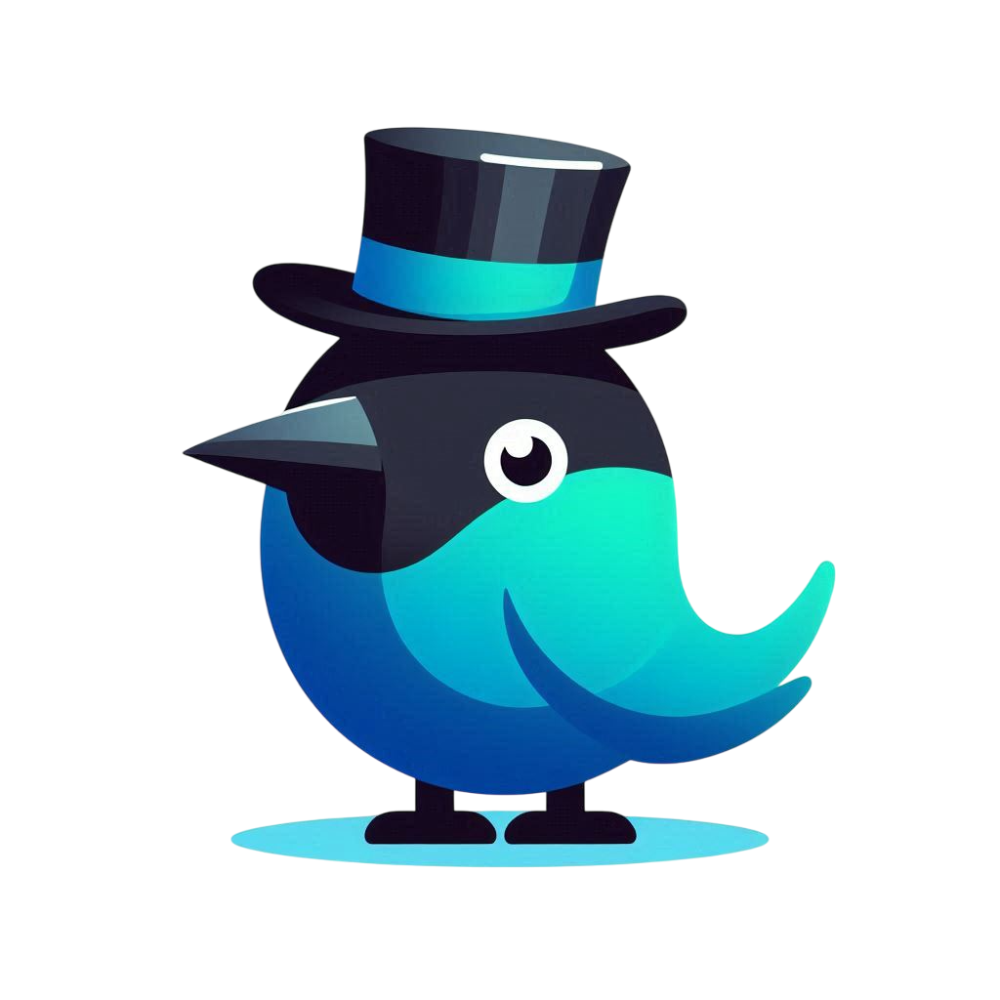

<p align="center">
  <a href="#"></a>
  <br/><br/>
  <font size="6"><b>AzureJay</b></font>
  <br/>
  <em>a neuro-symbolic language-learning platform</em>
  <br/><br/>
  <a href="#"></a>
  <a href="#"></a>
  <a href="#"></a>
  <a href="#"></a>
  
  
</p>
<hr/>


[](https://app.element.io/#/room/#space-azurejay:matrix.org)
[](https://calendly.com/azurejay)
[](https://fosstodon.org/@azurejay)

## About

AzureJay's mission is to revolutionize language learning through conversation-based AI interaction using the MRKL (Modular Reasoning, Knowledge and Language) architecture. Our platform provides an alternative to traditional language learning apps by focusing on natural conversation, precise pronunciation correction, and adaptive learning paths. All software is licensed under AGPLv3, which guarantees the freedom to run, study, share, and modify the software.

<details open="open">
  <summary>Table of Contents</summary>
  <ol>
    <li>
      <a href="#about">About</a>
    </li>
    <li>
      <a href="#using-azurejay">Using AzureJay</a>
      <ul>
        <li><a href="#web-app">Web app</a></li>
        <li><a href="#azurejay-api">AzureJay API</a></li>
        <li><a href="#azurejay-sdk">AzureJay SDK</a></li>
      </ul>
    </li>
    <li>
      <a href="#developing-azurejay">Developing AzureJay</a>
    </li>
    <li>
     <a href="#milestones">Milestones</a>
   </li>
    <li>
     <a href="#roadmap">Roadmap</a>
   </li>
   <li>
     <a href="#contribution">Contribution</a>
     <ul>
        <li><a href="#become-a-contributor">Become a contributor</a></li>
        <li><a href="#attributions">Attributions</a></li>
        <li><a href="#contributors">Contributors</a></li>
     </ul>
    </li>
    <li>
      <a href="#license">License</a>
    </li>
    <li>
      <a href="#see-also">See also</a>
    </li>
    <li>
      <a href="#donate">Donate</a>
    </li>
  </ol>
</details>

## Using AzureJay

### Web app

AzureJay offers an official [web app](https://azurejay.app/), which leverages the MRKL architecture for neuro-symbolic natural language processing. Try out AzureJay language learning through conversation right in your browser, no installation required!

#### Features

- 🗣️ Learn through natural conversation with AI language partners
- 🎯 Real-time pronunciation correction and feedback
- 🧠 MRKL architecture combines neural networks with symbolic reasoning
- 📊 Adaptive learning paths based on your progress and speaking patterns
- 🔄 Synchronize progress across multiple devices
- 📱 Works on various devices such as phones, tablets and desktop computers
- 👥 Community-owned and community-driven
- 🕊️ Free and open source software

#### Screenshots

<p align="center">
  
  
  
  
</p>

### AzureJay API

The AzureJay API allows developers to integrate our conversational language learning capabilities into their own applications. The API exposes endpoints for speech recognition, pronunciation assessment, grammar correction, and conversation generation.

#### Setup

To get started with the AzureJay API, register for an API key at our [developer portal](https://azurejay.app/api).

#### Basic API usage

```python
import azurejay

# Initialize the client
client = azurejay.Client(api_key="your_api_key")

# Create a language learning session
session = client.create_session(
    source_language="en",
    target_language="es",
    difficulty="intermediate"
)

# Start a conversation
response = session.start_conversation(
    topic="ordering food in a restaurant"
)

# Get AI response to user input
ai_response = session.send_message(
    text="Me gustaría ordenar una ensalada, por favor",
    audio_file="recording.wav"  # Optional: Include speech for pronunciation assessment
)

# Get pronunciation feedback
feedback = ai_response.pronunciation_feedback
```

### AzureJay SDK

Our SDK makes it even easier to build applications on top of AzureJay's conversational language learning technology.

#### Setup

The AzureJay SDK can be installed using pip:

```sh
pip install azurejay-sdk
```

#### Using the SDK in a Python program

```python
from azurejay_sdk import AzureJayClient

# Initialize the client
client = AzureJayClient(api_key="your_api_key")

# Create a language learning conversation
conversation = client.create_conversation(
    native_language="en",
    learning_language="ja",
    proficiency_level="beginner"
)

# Get a prompt from the AI to practice specific vocabulary
prompt = conversation.get_practice_prompt(topic="shopping")
print(f"AI: {prompt.text}")

# Submit user's response for analysis
analysis = conversation.analyze_response(
    text="こんにちは、このシャツを買いたいです",
    audio=open("user_recording.wav", "rb")
)

print(f"Grammar score: {analysis.grammar_score}/10")
print(f"Pronunciation feedback: {analysis.pronunciation_feedback}")
print(f"AI response: {analysis.ai_response}")
```

## Developing AzureJay

Want to contribute to AzureJay? Or create your own fork? Perhaps you want to use it in your creative project?

To get started with running the development environment on your computer and understanding the software architecture, [head to our development documentation](https://azurejay.app/docs/).

## Milestones

- [x] 🏁 Core MRKL architecture implementation
- [x] 🏁 Basic conversational AI for language learning
- [x] 🏁 Speech recognition and pronunciation assessment
- [x] 🏁 Basic theme/branding
- [x] 🏁 Course progress synchronization across devices
- [x] 🏁 Initial language support for English and Portuguese
- [ ] 🏁 Advanced grammar correction and explanation
- [ ] 🏁 Cultural context integration in conversations
- [ ] 🏁 Spaced repetition based on conversation history

## Roadmap

- [ ] Add support for Asian languages (Japanese, Mandarin, Korean)
- [ ] Implement dialect recognition and support
- [ ] Integrate with voice assistants for hands-free learning
- [ ] Add AR/VR immersive learning experiences

### Projects

- [Improved pronunciation feedback system](https://github.com/luisbernardinello/AzureJay/projects/1)
- [Cultural context integration](https://github.com/luisbernardinello/AzureJay/projects/2)

## Contribution

### Become a contributor

#### Are you a developer?

You can help AzureJay by testing it and submitting feature requests or bug reports: [here](https://github.com/luisbernardinello/AzureJay/issues/new). If you want to get in touch, you can use my contact details on [my GitHub profile](https://github.com/luisbernardinello).
Go through the dev docs [here](https://azurejay.app/docs/CONTRIBUTING.html).

Still got questions? Our Matrix channel is `#AzureJay`, join the dev community there and feel free to ask anything.

- Matrix: [`#AzureJay`](https://app.element.io/#/room/#space-azurejay:matrix.org) on `matrix.org`

#### Are you a linguist or language teacher?

Help us improve our language models and conversational patterns!

We are continuously working to improve the learning experience. If you have ideas to make it better, please share them with us by creating an [issue](https://github.com/luisbernardinello/AzureJay/issues/new).

### Attributions

#### Mascot

The mascot is designed by [@designer_username](https://github.com/luisbernardinello). If you have ideas to make it better, please share them with us by creating an [issue](https://github.com/luisbernardinello/AzureJay/issues/new).

<a rel="license" href="http://creativecommons.org/licenses/by-sa/4.0/"></a><br />Mascot images are released under <a rel="license" href="http://creativecommons.org/licenses/by-sa/4.0/">Creative Commons Attribution-ShareAlike 4.0 International License</a>.

### Contributors

<!-- ALL-CONTRIBUTORS-BADGE:START - Do not remove or modify this section -->

[](#contributors-)

<!-- ALL-CONTRIBUTORS-BADGE:END -->

Thanks goes to these wonderful people ([emoji key](https://allcontributors.org/docs/en/emoji-key)):

<!-- ALL-CONTRIBUTORS-LIST:START - Do not remove or modify this section -->
<!-- prettier-ignore-start -->
<!-- markdownlint-disable -->
<table>
  <tbody>
    <tr>
      <td align="center" valign="top" width="14.28%"><a href="https://github.com/luisbernardinello"><br /><sub><b>Luis Bernardinello</b></sub></a><br /><a href="https://github.com/luisbernardinello/AzureJay/commits?author=luisbernardinello" title="Code">💻</a></td>
      <!-- Add other contributors as needed -->
    </tr>
  </tbody>
</table>

<!-- markdownlint-restore -->
<!-- prettier-ignore-end -->

<!-- ALL-CONTRIBUTORS-LIST:END -->

This project follows the [all-contributors](https://github.com/all-contributors/all-contributors) specification. Contributions of any kind welcome!

## License

AzureJay is licensed under the AGPL-3.0 license. In addition, course content and other creative content might be licensed under different licenses, such as CC.

## See also

- [Duolingo](https://www.duolingo.com/), gamified language learning
- [Tandem](https://www.tandem.net/), language exchange with real people
- [italki](https://www.italki.com/), connect with language teachers

## Donate

Help us to keep going and expand our language offerings by supporting the project.
